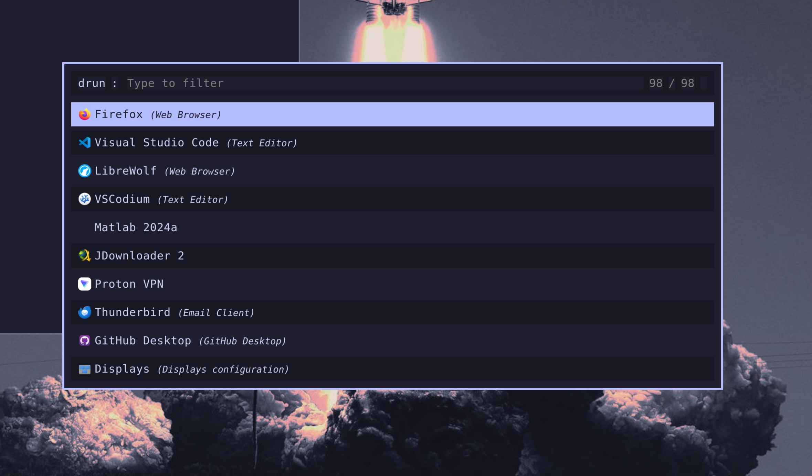
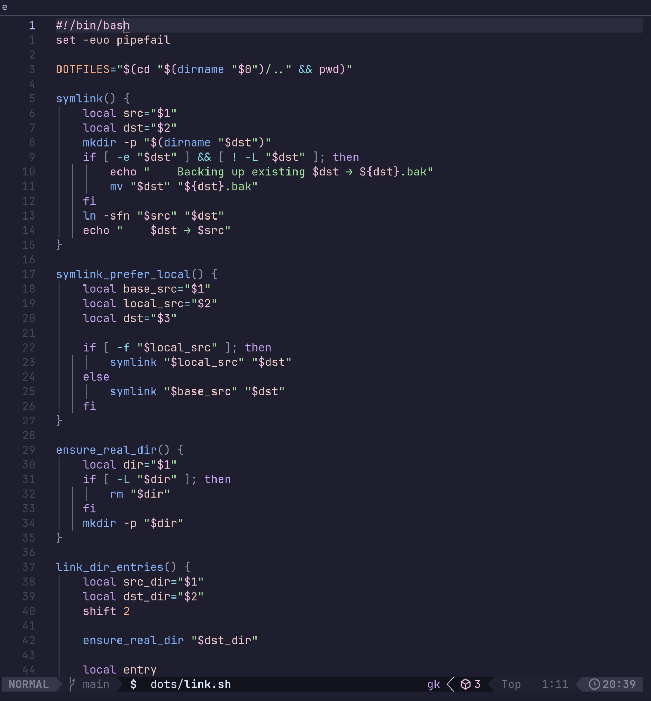
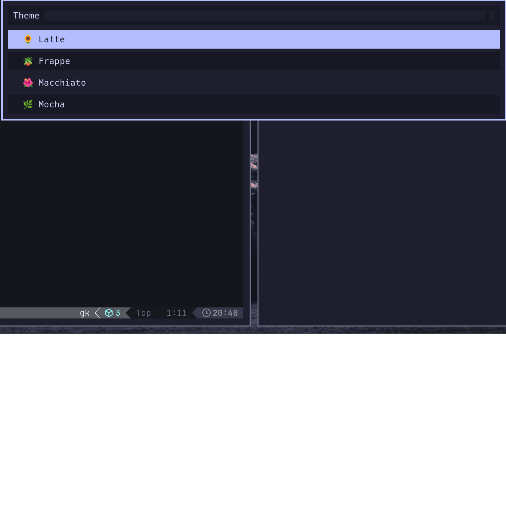
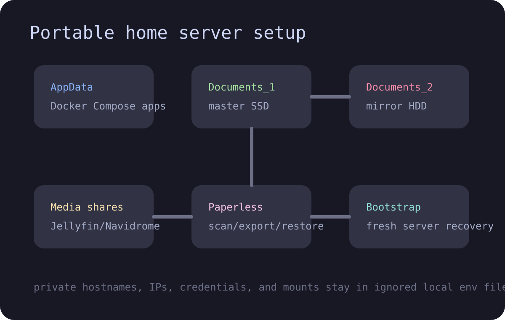
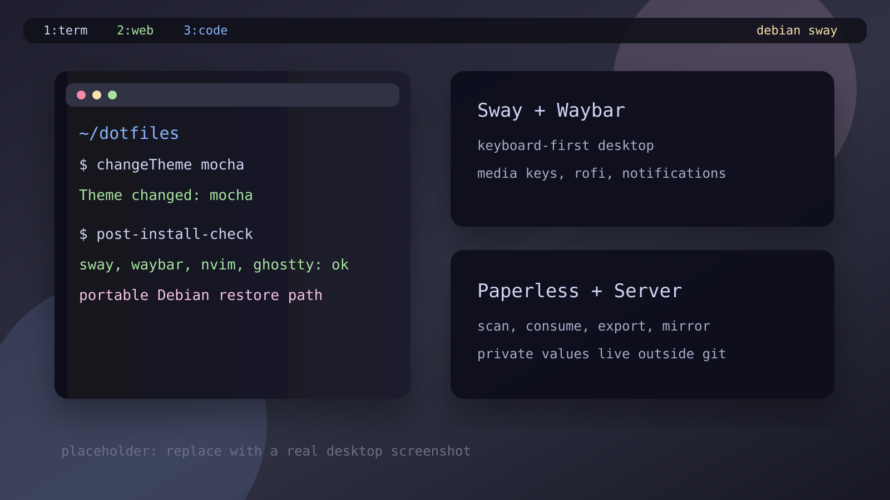
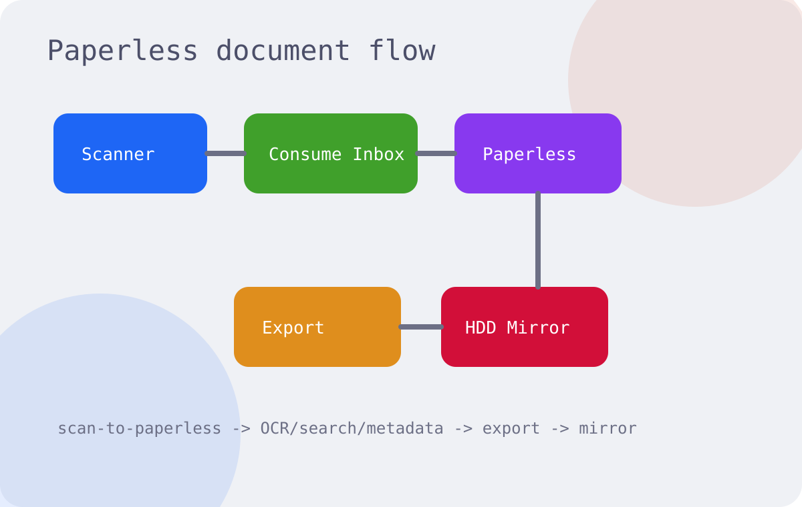

<div align="center">

# VhI3 Dotfiles

**A portable Debian/Sway workstation, tuned for keyboard-first daily work, local documents, and fast restore after a fresh install.**




</div>

---

## At A Glance

This repo is not just a theme dump. It is a complete, repeatable Linux workstation setup:

- Minimal Debian install path, from base packages to Wayland desktop
- Sway, Waybar, Rofi, SwayNotificationCenter, Ghostty, Kitty, Neovim, and terminal tools
- Catppuccin theme switching across desktop, terminal, editor, notifications, eza, fzf, lazygit, VS Code, Ghostty, wallpapers, and PDF tools
- Paperless-ngx scanning helpers, SMB share mounting, document-drive mirroring, and server restore notes
- Local-only config pattern for private values, credentials, hostnames, LAN IPs, and machine-specific mounts

## Showcase

The public gallery uses screenshots that do not expose private documents, real LAN details, or local account configuration.

| Launcher | Neovim |
|---|---|
|  |  |

| Theme Switcher | Workflow |
|---|---|
|  |  |

| Desktop Placeholder | Paperless Workflow |
|---|---|
|  |  |

## Workflow Map

```text
Fresh Debian
    -> install.sh --fresh-minimal
    -> dots/link.sh
    -> setup-local-configs
    -> post-install-check

Laptop
    -> Sway + Waybar + Rofi + Ghostty
    -> Neovim + CLI tools
    -> scan-to-paperless

Home server
    -> Paperless-ngx
    -> media shares
    -> Documents_1 master
    -> Documents_2 mirror
```

---

## Philosophy

- Start from Debian minimal (server ISO) — no GNOME, no KDE, no bloat
- Build up only what is needed, layer by layer
- Consistent Catppuccin theme switching across terminal, editor, desktop, and mail
- Keyboard-first workflow — mouse is optional
- Wayland-native where possible; XWayland only as fallback

---

## Stack

### Window System
| Tool | Role |
|------|------|
| [Sway](https://swaywm.org) | Tiling Wayland compositor (i3-compatible) |
| [SDDM](https://github.com/sddm/sddm) | Optional display manager / login screen |
| [Waybar](https://github.com/Alexays/Waybar) | Status bar |
| [Rofi](https://github.com/davatorium/rofi) | App launcher + power menu |
| [SwayNotificationCenter](https://github.com/ErikReider/SwayNotificationCenter) | Notification daemon + control center |
| [Kanshi](https://git.sr.ht/~emersion/kanshi) | Automatic display profiles |
| [Swaylock](https://github.com/swaywm/swaylock) | Screen locker |
| [Swaybg](https://github.com/swaywm/swaybg) | Wallpaper |

### Terminal & Shell
| Tool | Role |
|------|------|
| [Ghostty](https://ghostty.org) | Default terminal |
| [Kitty](https://sw.kovidgoyal.net/kitty/) | Secondary GPU-accelerated terminal |
| Bash | Shell with custom aliases and functions |
| [Nala](https://gitlab.com/volian/nala) | Friendlier frontend for Debian's apt package manager |
| [FZF](https://github.com/junegunn/fzf) | Fuzzy finder (Ctrl+R, Ctrl+T) |
| [eza](https://github.com/eza-community/eza) | Modern `ls` replacement with icons |
| [bat](https://github.com/sharkdp/bat) | `cat` with syntax highlighting |
| [ranger](https://github.com/ranger/ranger) | Terminal file manager |
| [pass](https://www.passwordstore.org/) | Minimal GPG-backed password manager |
| [Fastfetch](https://github.com/fastfetch-cli/fastfetch) | Terminal system summary |
| [duf](https://github.com/muesli/duf) | Better `df` for mounted filesystems |
| [ncdu](https://dev.yorhel.nl/ncdu) | Terminal disk usage explorer |
| [btop](https://github.com/aristocratos/btop) | Keyboard-friendly process and system monitor |
| [trash-cli](https://github.com/andreafrancia/trash-cli) | Safer file deletion to trash |
| [glow](https://github.com/charmbracelet/glow) | Markdown reader in terminal |
| `cifs-utils` + `ntfs-3g` | SMB/NAS shares and NTFS external drive mounting |

### Editors
| Tool | Role |
|------|------|
| [Neovim](https://neovim.io) | Primary editor (AppImage, always latest) |
| [LazyVim](https://lazyvim.org) | Neovim config framework |
| Vim | Fallback editor (vim-gtk3 + Vundle + Dracula) |
| [ipynb.nvim](https://github.com/ajbucci/ipynb.nvim) | Jupyter notebook editing with inline image rendering (Kitty graphics protocol) |
| [claudecode.nvim](https://github.com/coder/claudecode.nvim) | Claude Code integration |
| [llama.vscode](https://github.com/ggml-org/llama.vscode) | Local offline VS Code code completion |

Neovim is configured with LSP support for C/C++ (clangd), Python (pylsp), Rust (rust-analyzer), and LaTeX (vimtex + Zathura).

### Development
| Tool | Role |
|------|------|
| GCC / G++ | C and C++ compilers |
| CMake + Ninja | Build system (standard for C/C++ projects) |
| Clangd | C/C++ language server (LSP) |
| GDB | Debugger |
| Valgrind | Memory error detector |
| Rust (rustup) | Systems programming language + rust-analyzer |
| Python 3 | Scripting + scientific computing |
| Node.js (nvm) | JavaScript runtime (required by some LSP servers) |
| Lua + LuaRocks | Scripting (used by Neovim internals) |

### Scientific Writing
| Tool | Role |
|------|------|
| [TeXLive](https://tug.org/texlive/) (full) | Complete LaTeX distribution |
| [Zathura](https://pwmt.org/projects/zathura/) | Minimal PDF viewer with Vim keybindings |
| [Gnuplot](http://www.gnuplot.info) | Data visualization and plotting |
| [GNU Octave](https://octave.org) | MATLAB-compatible scientific computing |

### Applications
| Tool | Role |
|------|------|
| Firefox | Browser (from Mozilla's official apt repo) |
| LibreWolf | Privacy-hardened Firefox fork |
| Thunderbird | Email client |
| Signal Desktop | Secure messenger |
| Calibre | E-book manager |
| Spotify | Music |
| GitHub Desktop | Git GUI |
| VSCodium | Telemetry-free VS Code |
| NeoMutt | Terminal email client |
| [mbsync](https://isync.sourceforge.io/) | Sync IMAP mail to local Maildir |
| [msmtp](https://marlam.de/msmtp/) | Send mail through SMTP |
| Lazygit | Terminal Git UI |

---

## Structure

```
dotfiles/
├── install.sh          ← interactive installer
├── layers/             ← install scripts, run in order
│   ├── 00-sudo.sh      ← add user to sudoers (run as root first)
│   ├── 01-base.sh      ← nala bootstrap, base packages, Python, Node (nvm), Rust
│   ├── 02-cli.sh       ← Neovim, fzf, ranger, eza, lazygit, bat, pass, fastfetch, duf, ncdu, btop, trash-cli, glow, cifs-utils, ntfs-3g, vim
│   ├── 03-wayland.sh   ← sway stack, ghostty, kitty, rofi, swaync, grim, swaylock, kanshi
│   ├── 04-fonts.sh     ← JetBrainsMono & SpaceMono Nerd Fonts
│   ├── 05-dev.sh       ← gcc, cmake, ninja, clangd, gdb, rust-analyzer, lua
│   ├── 06-apps.sh      ← firefox, librewolf, signal, calibre, spotify, thunderbird, vscodium, mail stack
│   ├── 07-grub.sh      ← Catppuccin GRUB theme installer
│   ├── 08-octave.sh    ← latest stable GNU Octave with symbolic & statistics packages
│   └── 09-sddm.sh      ← SDDM + Catppuccin login theme installer
├── dots/
│   └── link.sh         ← symlinks everything to the right place
├── config/             ← ~/.config/* (sway, waybar, nvim, rofi, ...)
│   ├── fastfetch/      ← Fastfetch config (Hyprdots-inspired layout)
│   ├── isync/          ← mbsync IMAP config
│   ├── msmtp/          ← SMTP sending config
│   ├── mutt/           ← NeoMutt config + Catppuccin themes
│   ├── kitty/          ← Kitty config + Catppuccin themes
│   ├── rofi/           ← Rofi config + Catppuccin themes
│   ├── swaync/         ← SwayNotificationCenter config + CSS
│   ├── waybar/         ← Waybar config + Catppuccin themes
│   └── sway/hosts/     ← per-machine Sway settings
├── home/               ← ~/.*  (bashrc, bash_aliases, vimrc)
├── bin/                ← ~/.local/bin/ (changeTheme, sync-mail, mount-sd, setup-epos, focus-or-launch, matlab-sway, wallpaper, ...)
└── assets/
    └── wallpapers/     ← wallpapers
```

---

## Installation

### Fresh Minimal Debian Sequence

If you start from a minimal Debian install, use this order:

1. If your user is not in `sudo`, run layer `00` as `root`.
2. Run the full installer stack.
3. Link the dotfiles.
4. Generate the local machine-specific config files.
5. Adjust only the local settings that differ on that machine.
6. Re-run the linker.

On a fresh Debian install:

```bash
# 1. Install the minimum tools needed to fetch the dotfiles
su -
apt update
apt install -y sudo git curl wget ca-certificates

# 2. If needed, add your user to sudo
cd /tmp
git clone https://github.com/VhI3/dotfiles.git
cd dotfiles
bash layers/00-sudo.sh

# 3. Log back into your normal user, then clone again into your home
git clone https://github.com/VhI3/dotfiles.git ~/dotfiles

# 4. Run the full portable installer path
cd ~/dotfiles
./install.sh --fresh-minimal

# 5. Create local machine-specific config files
setup-local-configs

# 6. Edit the generated local files, then relink
./dots/link.sh
```

The installer presents a menu when run without arguments. Run layers in order (0 → 9) on a fresh machine, or pick individual layers to update specific tools. Run `l` at any time to symlink configs without reinstalling anything.

Portable non-interactive modes:

```bash
./install.sh --fresh-minimal
./install.sh --all
./install.sh --link
```

### Machine-Specific Local Files

These are intentionally not meant to be shared as-is across machines:

- `~/.config/dotfiles/document-drives.env`
- `~/.config/dotfiles/media-shares.env`
- `~/.config/restic-backup.conf`
- `~/.config/dotfiles/paperless-tools.local.conf`

Generate them from templates with:

```bash
setup-local-configs
```

Verify the restored machine with:

```bash
post-install-check
```

For the full restore workflow, see:

```bash
~/dotfiles/PORTABILITY.md
```

Linking also:

- runs the Sway host selector automatically
- initializes the shared Catppuccin theme files
- links helper scripts into `~/.local/bin`
- links `~/.config/swaync` for notifications

On a fresh machine, linking does not force-enable the document mirror timer unless the local drive config is present and ready.

If the current hostname matches a file in `config/sway/hosts/`, it becomes the active per-machine Sway config.

Example:

```bash
~/.local/bin/select-sway-host laptop
```

To install the Catppuccin GRUB theme directly:

```bash
./layers/07-grub.sh
```

To pick a different flavor:

```bash
GRUB_THEME_FLAVOUR=macchiato ./layers/07-grub.sh
```

Available GRUB flavours:

- `latte`
- `frappe`
- `macchiato`
- `mocha`

To install the Catppuccin SDDM theme directly:

```bash
./layers/09-sddm.sh
```

To pick a different flavour and accent:

```bash
SDDM_THEME_FLAVOUR=macchiato SDDM_THEME_ACCENT=blue ./layers/09-sddm.sh
```

Available SDDM flavours:

- `latte`
- `frappe`
- `macchiato`
- `mocha`

Available SDDM accents:

- `rosewater`
- `flamingo`
- `pink`
- `mauve`
- `red`
- `maroon`
- `peach`
- `yellow`
- `green`
- `teal`
- `sky`
- `sapphire`
- `blue`
- `lavender`

Note: upstream recommends running the SDDM greeter on Wayland if the Catppuccin theme renders incorrectly on X11.

To install the latest stable Octave directly:

```bash
./layers/08-octave.sh
```

To install the faster Debian-packaged version with common add-on packages:

```bash
OCTAVE_INSTALL_MODE=apt ./layers/08-octave.sh
```

This installs:

- `octave`
- `octave-control`
- `octave-image`
- `octave-io`
- `octave-optim`
- `octave-signal`
- `octave-statistics`
- `octave-symbolic`

To pin a specific version instead:

```bash
OCTAVE_VERSION=11.1.0 ./layers/08-octave.sh
```

To rebuild the current source version with updated dependencies (for example, to restore GUI support):

```bash
OCTAVE_FORCE_REBUILD=1 ./layers/08-octave.sh
```

---

## Host-Specific Sway Setup

Shared Sway behavior lives in `config/sway/config`.

Machine-specific settings such as:

- monitor layout / scaling
- workspace-to-output mapping
- wallpaper path
- personal autostart programs

belong in `config/sway/hosts/<hostname>.conf`.

Current host profiles:

- `debian`
- `laptop`

To add another machine:

```bash
cp config/sway/hosts/laptop.conf config/sway/hosts/workstation.conf
~/.local/bin/select-sway-host workstation
```

The generated file `config/sway/host.local.conf` is local state and is intentionally not tracked by git.

For the current `debian` host, monitor switching is handled dynamically by `kanshi`:

- if `HDMI-A-2` is connected, use the external monitor only
- otherwise, use the laptop screen only

That logic lives in `config/kanshi/config`, while the Sway host file keeps machine-specific autostarts and wallpaper commands.

For the current `debian` host, those autostarts include desktop helpers like `nm-applet`, `thunderbird`, `pcloud`, and audio utilities.

---

## Theme

**Catppuccin** throughout — Ghostty, Kitty, Neovim, NeoMutt, Ranger, Rofi, Sway, Swaylock, Waybar, Zathura, eza, VS Code / VSCodium, VS Code icons, SDDM, wallpapers, and the notification stack.

Theme switching is unified through:

- `changeTheme`
- `changeTheme.sh`
- `Mod+Shift+t` in Sway

Available flavours:

- Latte
- Frappe
- Macchiato
- Mocha

Font: **JetBrainsMono Nerd Font** (terminals, status bar, editors).

Note: NeoMutt follows the official Catppuccin NeoMutt setup, which ships a Latte variant and one shared dark variant for Frappe, Macchiato, and Mocha.

Waybar and SwayNotificationCenter keep their own config/style files, but both are part of the same desktop theme direction and follow the shared Catppuccin flavour through generated local theme files.

Wallpaper is part of the same shared theme flow too:

- `Latte` → light wallpaper
- `Frappe` → dark wallpaper
- `Macchiato` → dark wallpaper
- `Mocha` → dark wallpaper

The wallpaper helper stores the active flavour in `~/.config/wallpaper/theme.local` and reapplies the matching image when `changeTheme` runs.

For VS Code / VSCodium, the shared theme switcher updates both:

- `workbench.colorTheme`
- `workbench.iconTheme`

So each flavour maps cleanly to the matching Catppuccin editor theme and icon pack:

- `Latte` → `Catppuccin Latte` + `catppuccin-latte`
- `Frappe` → `Catppuccin Frappé` + `catppuccin-frappe`
- `Macchiato` → `Catppuccin Macchiato` + `catppuccin-macchiato`
- `Mocha` → `Catppuccin Mocha` + `catppuccin-mocha`

Boot/login theming is handled separately through the install layers:

- `07-grub.sh` for GRUB
- `09-sddm.sh` for SDDM

---

## Mail

Mail is configured as a local-first terminal workflow:

- `neomutt` for reading and composing
- `mbsync` for syncing IMAP to `~/Mail`
- `msmtp` for SMTP sending
- `pass` for secret storage

Config locations:

- `config/mutt/muttrc`
- `config/isync/mbsyncrc`
- `config/msmtp/config`

Helper commands:

- `mail` → start NeoMutt
- `sync-mail` → sync mailboxes
- `mbs` → run mbsync directly

Pass entries expected by your local mail setup:

- `mail/example.org/imap`
- `mail/example.org/smtp`

---

## Helpers

Useful local scripts linked into `~/.local/bin`:

- `changeTheme` → switch the shared Catppuccin flavour
- `kitty-theme` → compatibility wrapper for the shared theme switcher
- `sync-mail` → sync NeoMutt mailboxes
- `mount-sd` → mount a removable SD card to `/mnt/sdcard`
- `mount-smb-share` → mount an SMB/CIFS share using a credentials file such as `~/.smb/media-server`
- `mount-ntfs` → mount an NTFS partition to a mountpoint under `/mnt`
- `mount-media-shares` → mount the default `Filme` and `Series` SMB shares
- `mount-document-shares` → mount server `Documents_1` and read-only `Documents_2` on the laptop
- `install-media-share-startup` → install a root systemd service that mounts the media shares at boot
- `kulturzeit-downloader` → download 3sat Kulturzeit into the Jellyfin `Series/Kulturzeit` share
- `setup-kulturzeit-downloader` → recreate the Kulturzeit venv/config after a fresh Debian restore
- `enable-ssd-hdd-mirror` → enable the default document-drive mirror mode (boot + hourly)
- `enable-ssd-hdd-mirror-fast` → enable a faster document-drive mirror mode (boot + every 15 minutes)
- `enable-ssd-hdd-live-sync` → enable the optional live document-drive sync watcher
- `restic-backup` → create and inspect versioned restic snapshots
- `enable-restic-documents-backup` → enable the scheduled restic snapshot timer for `Documents_1`
- `safe-copy` → standard safe and resumable `rsync` copy helper for local disks or remote paths
- `file-agent` → local Ollama-powered file-management agent, confined to one chosen root directory
- `sort-pdfs` → deduplicate PDFs first, then sort them into `books`, `theses`, `papers`, `others`, and `duplicates`
- `sort-library` → sort a mixed library folder into PDFs, archives, images, audio, videos, ebooks, documents, and duplicates
- `rename-pdf-from-title` → rename PDF files from their embedded `Title` metadata
- `show-keybindings` → open a Rofi cheat sheet for your main Sway shortcuts
- `rofi-wifi` → manage Wi-Fi networks from a Rofi menu via NetworkManager (`nmcli`)
- `connect-keychron` → reconnect the trusted Keychron keyboard over Bluetooth
- `setup-epos` → restore the EPOS ADAPT E1 / BTD 900c media-key setup on a fresh install
- `focus-or-launch` → jump to an existing app window or launch it on the target workspace
- `matlab-sway` → start MATLAB with the Sway / XWayland compatibility environment
- `notify-media` → show song/artist notifications for media transport keys
- `notify-layout` → watch keyboard layout changes and show `EN` / `IR` notifications
- `select-sway-host` → choose the active host-specific Sway file
- `setup-claudecode` → disable old Codeium paths and prepare the Claude Code Neovim setup
- `setup-llama-vscode` → link a local `llama-server` binary into `~/.local/bin` for `llama.vscode`
- `setup-vscode-catppuccin` → install the Catppuccin VS Code / VSCodium theme and icon extensions
- `llama-vscode-cpu` → start the small CPU-only `llama.vscode` completion server on `127.0.0.1:8012`
- `wallpaper` → set wallpaper from the current shared flavour or an explicit image path
- `update-nvim` → refresh the Neovim AppImage
- `nvim-repair` → general Neovim repair toolbox for startup checks and Lazy.nvim cache problems
- `repair-nvim-lazy-cache` → compatibility shortcut for `nvim-repair lazy-cache`
- `repair-nvim-lspconfig-cache` → compatibility shortcut for `nvim-repair lspconfig-cache`

`mount-sd` accepts an explicit block device like `mount-sd /dev/mmcblk0p1`, but will also mount to `/mnt/sdcard` with the default helper path.

`mount-smb-share` is for NAS / CasaOS-style SMB mounts. It expects a credentials file at `~/.smb/media-server` by default and auto-creates the mountpoint under `/mnt` if you pass a short name:

```bash
mount-smb-share "//server.local/Filme" filme
mount-smb-share "//server.local/Series" /mnt/tv_show
```

Credential file format:

```text
username=your-user
password=your-password
```

`mount-ntfs` wraps the repeated `ntfs-3g` workflow for external disks:

```bash
mount-ntfs /dev/sda1 oneTB
mount-ntfs /dev/sdc1 /mnt/oneTB
```

`safe-copy` is the standard fast-and-safe copy wrapper now. It uses `rsync` with resumable partial transfers, overall progress, and timestamp handling that behaves better on removable filesystems like NTFS, FAT, or exFAT:

```bash
safe-copy /media/$USER/source-drive/ /media/$USER/backup-drive/
safe-copy --dry-run /media/$USER/source-drive/ /media/$USER/backup-drive/
safe-copy --verify /media/$USER/source-drive/ /media/$USER/backup-drive/
```

Short alias:

```bash
cpr /media/$USER/source-drive/ /media/$USER/backup-drive/
```

Useful options:

- `--dry-run` previews the transfer without copying
- `--verify` runs a checksum-based verification pass after copying
- `--ignore-existing` skips files that are already present at the destination

The usual `rsync` slash rule still applies:

- `source/` copies the contents of the source directory
- `source` copies the directory itself

`file-agent` uses your local Ollama server as a planner and your existing local scripts as the actual file-management tools. It is intentionally confined to a single root directory that you choose on the command line, and write operations only happen when you pass `--confirm`:

```bash
file-agent plan ~/Downloads
file-agent plan ~/Downloads "Find duplicates and suggest a cleanup plan"
file-agent organize ~/Downloads
file-agent organize ~/Downloads --confirm
file-agent apply ~/Downloads --confirm "Normalize names and sort mixed files"
```

For CPU responsiveness, the default model is `qwen2.5-coder:1.5b`. If you want a slower but sometimes stronger planner, you can override it with `gemma4:e4b`:

```bash
file-agent plan ~/Downloads --model gemma4:e4b
```

The default `plan` mode and the default dry-run `organize` mode use a lighter one-shot planner path so they return faster on CPU-only hardware. The heavier multi-step tool-calling path is mainly used when you ask for explicit apply/confirm behavior.

Available local tools exposed to the agent include:

- `list_dir`
- `search_files`
- `file_info`
- `read_text_file`
- `normalize_names`
- `sort_library`
- `safe_copy`
- `make_directory`
- `move_path`
- `trash_path`

This makes `file-agent` useful for practical local data cleanup without giving the model unrestricted filesystem access.

`sort-pdfs` is the main PDF triage helper now. It removes duplicates first, including obvious same-content files with different names, then sorts the remaining PDFs into `books`, `theses`, `papers`, `others`, and `duplicates`:

```bash
sort-pdfs --source ~/Downloads/books-final --dest ~/Downloads/books-final
sort-pdfs --source ~/Downloads/books-final --dest ~/Downloads/books-final --apply
```

You can tune the classification thresholds or run it on a wider tree if needed:

```bash
sort-pdfs --source ~/Downloads --dest ~/Downloads/pdf-library --recursive --apply
sort-pdfs --min-book-pages 120 --source ~/Downloads/books-final --dest ~/Downloads/books-final --apply
sort-pdfs --copy --source ~/Downloads/books-final --dest ~/Downloads/books-final --apply
```

After sorting, you can import the curated books into Calibre with:

```bash
calibredb add ~/Downloads/books-final/books/*.pdf
```

`rename-pdf-from-title` still fits well in the new workflow. After `sort-pdfs`, it is useful when you want cleaner filenames inside `books/` or `papers/` before importing into Calibre:

```bash
rename-pdf-from-title --source ~/Downloads/books-final/books
rename-pdf-from-title --source ~/Downloads/books-final/books --with-author --apply
rename-pdf-from-title --source ~/Downloads/books-final/papers --apply
```

It reads the PDF `Title` metadata, optionally prefixes the `Author`, then normalizes the result into a POSIX-friendly filename. It is best used after sorting, and usually not on `duplicates/` or `others/`.

`sort-library` is the broader intake helper for mixed folders that contain PDFs plus other file types like archives, photos, audio, or ebooks. It sends PDFs through `sort-pdfs`, deduplicates exact-match non-PDF files by hash, and places the rest into sensible category folders:

```bash
sort-library --source ~/Downloads/tmpp --dest ~/Downloads/tmpp
sort-library --source ~/Downloads/tmpp --dest ~/Downloads/tmpp --apply
sort-library --source ~/Downloads/tmpp --dest ~/Downloads/library --recursive --apply
```

Non-PDF outputs are grouped into:

- `archives/`
- `images/`
- `audio/`
- `videos/`
- `ebooks/`
- `documents/`
- `misc/`
- `duplicates/`

This is useful as the first cleanup pass before you manually review the curated `books/`, `papers/`, or `others/` folders.

`mount-media-shares` mounts your default Samba shares in one step:

```bash
mount-media-shares
```

Short alias:

```bash
mntmedia
```

By default it expects values from `~/.config/dotfiles/media-shares.env`. Without that local file, the defaults are only generic examples:

- `//media-server.local/Filme` → `/mnt/filme`
- `//media-server.local/Series` → `/mnt/tv_show`
- optional: `//media-server.local/Audiobooks` → `/mnt/audiobooks`
- optional: `//media-server.local/Music` → `/mnt/music`
- optional: `//media-server.local/Paperless-Consume` → `/mnt/paperless-consume`

If your server credentials are no longer the old CasaOS credentials, add this to
`~/.config/dotfiles/media-shares.env`:

```bash
SMB_CREDENTIALS_FILE=$HOME/.smb/home-server
```

For the Paperless server workflow, configure:

```bash
PAPERLESS_CONSUME_SHARE=Paperless-Consume
PAPERLESS_CONSUME_MOUNT=/mnt/paperless-consume
```

Then one command mounts the media shares and the Paperless scan inbox:

```bash
mount-media-shares
scan-to-paperless
```

Override with environment variables when needed:

```bash
SMB_HOST=server.local mount-media-shares
```

`mount-document-shares` mounts the document SSD/HDD shares from `home-server`:

```bash
mount-document-shares
```

By default:

- `//192.168.1.10/Documents_1` → `/mnt/documents_1`
- `//192.168.1.10/Documents_2` → `/mnt/documents_2`
- `Documents_1` is the working SSD share
- `Documents_2` is mounted read-only on the laptop as the mirror-inspection share

Configure it in:

```text
~/.config/dotfiles/document-shares.env
```

Mount only one side when needed:

```bash
mount-document-shares --master-only
mount-document-shares --mirror-only
```

`kulturzeit-downloader` is the portable dotfiles launcher for the project in
`~/dev/kulturzeit-downloader`.

Setup after a fresh Debian restore:

```bash
setup-kulturzeit-downloader
```

Normal run:

```bash
kulturzeit-downloader
```

Dry run:

```bash
kulturzeit-downloader --dry-run
```

The dotfiles config lives in:

```text
~/.config/dotfiles/kulturzeit-downloader.env
```

Default target:

```text
/mnt/tv_show/Kulturzeit
```

`kulturzeit-downloader` tries `mount-media-shares` first if `/mnt/tv_show` is
not mounted. The downloader itself also has a mount guard, so it should not
write into a fake local `/mnt/tv_show` folder.

`install-media-share-startup` installs a root `systemd` unit that waits for the network and mounts the configured media shares during boot:

```bash
./dots/link.sh
install-media-share-startup
```

This expects the Samba/CasaOS share definitions on the server to point at the current real paths. If the server-side share still points to an old directory, fix the Samba export first and then enable the startup service.

Example Samba share names:

- `Filme`
- `Series`

Example server-side directories:

- `/DATA/Filme`
- `/DATA/Series`

So if mounts start failing with `NT_STATUS_BAD_NETWORK_NAME`, check the server's Samba config and make sure those share definitions point at the new `/DATA/...` paths.

## Document Drive Backup

The external document drives use two separate local config files:

- `~/.config/dotfiles/media-shares.env` for Samba / CasaOS shares
- `~/.config/dotfiles/document-drives.env` for `Documents_1` / `Documents_2`

Tracked examples live in:

- `config/dotfiles/media-shares.env.example`
- `config/dotfiles/document-drives.env.example`

Recommended default:

- `Documents_1` = working external SSD
- `Documents_2` = backup external HDD
- `ssd-hdd-mirror.timer` = scheduled mirror for quick recovery
- `restic-documents-backup.timer` = versioned snapshots for rollback safety

Default mirror mode:

```bash
enable-ssd-hdd-mirror
```

This enables the normal mirror timer:

- runs a few minutes after boot
- repeats roughly every hour

Faster scheduled mirror mode:

```bash
enable-ssd-hdd-mirror-fast
```

This mode:

- runs a few minutes after boot
- repeats roughly every 15 minutes

Optional live sync mode:

```bash
enable-ssd-hdd-live-sync
```

This is only for near-immediate propagation and needs `inotify-tools` (`inotifywait`). It is not the safest backup mode because accidental deletes or bad changes can propagate quickly.

Switch back to the safer default from live sync:

```bash
systemctl --user disable --now ssd-hdd-live-sync.service
enable-ssd-hdd-mirror
systemctl --user enable --now restic-documents-backup.timer
```

Status checks:

```bash
systemctl --user status ssd-hdd-mirror.timer
systemctl --user status restic-documents-backup.timer
systemctl --user status ssd-hdd-live-sync.service
```

### Restic Snapshot Layer

`restic` stores versioned snapshots in a separate repository on the backup HDD. This protects you against accidental deletion or corruption better than mirroring alone.

Useful commands:

```bash
restic-backup env
restic-backup snapshots
restic-backup ls
restic-backup check
restic-backup restore
```

Enable the scheduled snapshot timer:

```bash
enable-restic-documents-backup
```

The local config file is:

```bash
~/.config/restic-backup.conf
```

Recommended repository location:

- keep the restic repo on `Documents_2`
- but store it as a separate repo directory such as:
  - `/media/$USER/Documents_2/restic-laptop`
- the mirror helper protects `restic-laptop/` and hidden `.restic*` repos from deletion

Current model:

- mirror = fast recovery copy
- restic = versioned rollback layer
- live sync = optional, only when explicitly needed

This is safer than relying on immediate mirroring alone.

Travel behavior:

- if `Documents_1` or `Documents_2` is not connected, the restic backup service now skips politely instead of failing the timer
- the journal message is written as `backup skipped: ...`, so missing external drives on the road do not look like a broken setup

Recommended trust check:

- do not only verify that snapshots exist
- also run one real restore test into a temporary folder later with `restic-backup restore`
- a backup is only fully trusted after you have successfully restored from it once

## Paperless Tools

Paperless document helpers live in:

```bash
~/dotfiles/projects/paperless-tools
```

Server restore runbook:

```bash
docs/PAPERLESS-SERVER-RESTORE.md
```

Full home-server bootstrap:

```bash
docs/HOME-SERVER-SERVER-BOOTSTRAP.md
bootstrap-home-server
bootstrap-home-server --apply
```

Use the bootstrap helper after a fresh Ubuntu/Debian server reinstall. It
reconnects the existing `/AppData`, `Documents_1`, and `Documents_2` disks,
configures Docker/Samba/systemd, starts the Compose apps, and restores the
hourly `Documents_1 -> Documents_2` mirror timer.

Main commands:

```bash
cd ~/dotfiles/projects/paperless-tools
setup-paperless-tools
./scan-to-paperless.sh
./scan-glass-to-paperless.sh
./list-naps2-profiles.sh
./check-paperless.sh
./backup-paperless-to-pcloud.sh
./restore-paperless-from-export.sh
```

Workflow:

- `NAPS2` scans into `$HOME/Documents/Scan-Inbox` by default on a local-only setup
- with server Paperless, `NAPS2` scans into the mounted server consume folder, for example `/mnt/paperless-consume`
- Paperless consumes from the inbox
- Paperless performs OCR / metadata / search
- exports are synced to pCloud and the external SSD
- restore from export is available as a dry-run-first helper
- `scan-to-paperless` is the normal smart command: it tries the duplex feeder first and falls back to glass scanning if the feeder is empty or fails
- `scan-to-paperless` refuses to scan into an unmounted `/mnt` or `/media` consume path, so it will not create a fake local folder when the server share is missing

Server-based Paperless client mode:

- local override file: `~/.config/dotfiles/paperless-tools.local.conf`
- recommended laptop consume mount: `/mnt/paperless-consume`
- mount the server consume share before scanning:

```bash
mount-paperless-consume
scan-to-paperless
```

- in this mode `check-paperless` checks the server URL and skips local Docker Compose checks
- backup/export timers should run on the server, not on the laptop client

Scanner modes:

- `scan-to-paperless` runs in `auto` mode by default
- `scan-to-paperless --mode duplex` uses only the duplex feeder
- `scan-to-paperless --mode glass` uses only the flatbed/glass
- `scan-glass-to-paperless` is a compatibility shortcut for `scan-to-paperless --mode glass`
- glass mode scans 2 pages into one color PDF by default and waits for Enter before each page
- for more glass pages, use `scan-to-paperless --mode glass --pages 4`
- for smaller grayscale PDFs, use `scan-to-paperless --mode glass --bitdepth gray`
- scan glass pages in the final order you want inside the PDF: front, back, next front, next back
- scans are written to a temporary file first, then moved into the Paperless consume folder only after success

NAPS2 font workaround:

- the dotfiles install a user fontconfig rule at `~/.config/fontconfig/conf.d/99-naps2-ignore-universalis-adf.conf`
- this hides the Debian `Universalis ADF` family from the user font list
- it fixes the NAPS2/PdfSharpCore scan crash:
  - `An item with the same key has already been added. Key: universalis adf std cond`
- the font package is not removed globally; only this duplicate-prone family is ignored for the user session

Portability model:

- tracked defaults live in `projects/paperless-tools/paperless-tools.conf`
- machine-specific overrides belong in:
  - `~/.config/dotfiles/paperless-tools.local.conf`
- example override file:
  - `projects/paperless-tools/paperless-tools.local.conf.example`
- the Paperless helper scripts use `$HOME` and `$USER` by default instead of hardcoded usernames
- on a new Debian laptop, run `setup-paperless-tools` once, then adjust only the values that differ in the generated local override file

### Server Paperless Backup

For the current `home-server` setup, backup happens on the server, not on the
laptop.

Model:

- Paperless imports scanned files into `Documents_1`
- `paperless-export-backup.timer` exports Paperless documents and metadata to `/mnt/Documents_1/20-Referenz/paperless-export`
- after the export, `mirror-documents-drives.service` mirrors `Documents_1 -> Documents_2`
- `Documents_2` therefore receives both the live document files and the portable Paperless export

Server checks:

```bash
ssh your-user@192.168.1.10
systemctl status paperless-export-backup.timer --no-pager
systemctl status paperless-export-backup.service --no-pager
journalctl -u paperless-export-backup.service -n 80 --no-pager
ls -lh /mnt/Documents_1/20-Referenz/paperless-export/manifest.json
```

Manual server export:

```bash
sudo systemctl start paperless-export-backup.service
```

This is the important backup layer for Paperless metadata, tags,
correspondents, document types, and searchable restore data.

### Local Paperless Backup Timers

Default hourly Paperless export backup:

```bash
enable-paperless-backup
```

This enables:

- `paperless-export-backup.timer`
- boot delay, then roughly hourly export/sync
- automatic propagation of Paperless deletions and metadata changes to:
  - `$HOME/pCloudDrive/Document/Paperless-Backup`
  - `/media/$USER/Documents_1/20-Referenz/paperless-export`

Optional faster mode:

```bash
enable-paperless-backup-fast
```

This switches to:

- `paperless-export-backup-fast.timer`
- boot delay, then roughly every 15 minutes

Status checks:

```bash
systemctl --user status paperless-export-backup.timer
systemctl --user status paperless-export-backup-fast.timer
systemctl --user status paperless-export-backup.service
journalctl --user -u paperless-export-backup.service -n 50 --no-pager
```

Recommended default:

- keep `enable-paperless-backup` as the normal mode
- use `enable-paperless-backup-fast` only if you want changes exported much sooner
- if pCloud or the external SSD is not mounted yet, the backup script skips that target safely instead of creating a fake local backup tree
- `restore-paperless-from-export` restores from a Paperless export into a running Paperless stack; it is dry-run by default and refuses non-empty imports unless explicitly allowed

`show-keybindings` opens a read-only Rofi overview of the most important launch, system, workspace, media, and layout shortcuts, so you can quickly remind yourself of the current Sway setup.

`rofi-wifi` gives you a small Wi-Fi control center in Rofi: scan, connect, disconnect, toggle Wi-Fi on/off, and view the current connection without leaving Sway.

`connect-keychron` reconnects the already-paired Keychron keyboard using `bluetoothctl`. Override the default device address with `KEYCHRON_BT_MAC=... connect-keychron` if needed.

`setup-epos` checks for `playerctl`, detects the EPOS consumer-control device when the dongle is plugged in, and ensures the Sway media-key bindings are present without duplicating them. It also installs fallback bindings for `XF86AudioForward` and `XF86AudioRewind`, which some headsets expose instead of `Next` / `Prev`.

`focus-or-launch` is used by most `Mod+letter` launcher bindings. If the app is already open, it focuses the existing window and jumps to its workspace; otherwise it launches the app on the assigned workspace.

`matlab-sway` wraps your MATLAB install with the environment variables and launch flags needed for stable startup under Sway/XWayland.

`setup-claudecode` removes stale LazyVim Codeium extras and lock entries, keeps Codeium disabled in the tracked Neovim config, keeps the Claude Code plugin files in the expected places, and helps verify that the Claude CLI is installed.

`setup-llama-vscode` is the lightweight helper for local VS Code completions with `llama.vscode`. It prefers `~/src/llama.cpp/build/bin/llama-server`, falls back to `~/.unsloth/llama.cpp/build/bin/llama-server`, and links the chosen binary into `~/.local/bin/llama-server` so the extension can find it.

`setup-vscode-catppuccin` installs the Catppuccin theme extension and Catppuccin icon pack for `code` / `codium`, while `changeTheme` keeps both `workbench.colorTheme` and `workbench.iconTheme` in sync with the shared Catppuccin flavour.

`llama-vscode-cpu` starts the small CPU-friendly completion server used by the `Local, only completions - CPU` environment in `llama.vscode`. It uses `ggml-org/Qwen2.5-Coder-1.5B-Q8_0-GGUF` and binds to `127.0.0.1:8012` by default so it stays local-only.

Quick start for the local VS Code completion flow:

```bash
./dots/link.sh
setup-llama-vscode
which llama-server
llama-vscode-cpu
```

Then in another terminal:

```bash
curl http://127.0.0.1:8012/health
```

After that, start VS Code from a shell with:

```bash
code
```

and in `llama.vscode` choose the `Local, only completions - CPU` environment. Keep RAG, chat, and agent models disabled on CPU-only hardware unless you intentionally want the extra load.

`notify-media` is used by the Sway media-key bindings so play/pause/next/previous show a desktop notification with the current track for the active MPRIS player. When the player exposes album art through MPRIS, the notification also shows a thumbnail.

`notify-layout` runs in the background from Sway, shows a desktop notification when you switch keyboard layout, and works together with the Waybar language module so you can see `EN` / `IR` at a glance.

`wallpaper` can be used manually as `wallpaper /path/to/image`, but the normal path is through `changeTheme`, which maps each Catppuccin flavour to the corresponding wallpaper image in `assets/wallpapers/`.

Claude Code in Neovim also has a history picker:

- `<leader>ah` → open Claude session history and resume a session
- `:ClaudeCodeHistory` → command form of the same picker

Ranger is also customized for faster document triage:

- PDF previews use `pdftoppm` through `~/.config/ranger/scope.sh`
- `x` sends the selected file to trash immediately via `trash-put`
- `dd` cuts and `pp` pastes for file moves
- `gz` opens the current file in Zathura
- `gq` opens the current file in qpdfview

---

## Notifications

Notifications are handled by **SwayNotificationCenter** (`swaync`) instead of Mako or Dunst.

- `swaync` starts from Sway
- `Mod+Shift+n` toggles the notification center
- Waybar shows a notification icon module with left-click to open and right-click to toggle Do Not Disturb
- Waybar also shows the active keyboard layout as `EN` / `IR`

Config lives in:

- `config/swaync/config.json`
- `config/swaync/style.css`

If you previously had `dunst` installed, the Wayland layer tries to disable it so `org.freedesktop.Notifications` is owned by `swaync`.

The `swaync` stylesheet is also part of the shared Catppuccin setup, so notification colors follow the same flavour as the rest of the desktop.

---

## Key Bindings (Sway)

| Key | Action |
|-----|--------|
| `Mod+Return` | Open terminal (Ghostty) |
| `Mod+Shift+Return` | Open Kitty |
| `Mod+d` | App launcher (rofi) |
| `Mod+i` | Wi-Fi menu (Rofi + NetworkManager) |
| `Mod+/` | Show keybinding cheat sheet |
| `Mod+w` | Focus or launch Firefox on workspace 2 |
| `Mod+e` | Focus or launch Nautilus on workspace 9 |
| `Mod+c` | Focus or launch VS Code on workspace 3 |
| `Mod+t` | Focus or launch Telegram on workspace 7 |
| `Mod+m` | Focus or launch Thunderbird on workspace 8 |
| `Mod+g` | Focus or launch GitHub Desktop on workspace 6 |
| `Mod+p` | Focus or launch Spotify on workspace 10 |
| `Mod+z` | Launch Zathura |
| `Mod+x` | Focus or launch Xournal++ on workspace 4 |
| `Mod+y` | Focus or launch MATLAB on workspace 5 |
| `Mod+Shift+t` | Open Catppuccin theme picker |
| `Mod+Shift+n` | Toggle notification center (`swaync`) |
| `Mod+Shift+e` | Power menu (rofi) |
| `Mod+Shift+x` | Lock screen (swaylock) |
| `Mod+h/j/k/l` | Focus left/down/up/right |
| `Mod+Shift+h/j/k/l` | Move window |
| `Mod+Ctrl+s` | Stacking layout |
| `Mod+Ctrl+w` | Tabbed layout |
| `Mod+Ctrl+e` | Toggle split layout |
| `Mod+f` | Fullscreen |
| `Mod+r` | Resize mode |
| `Caps Lock` | Escape (remapped) |
| `Print` | Screenshot (grim) |
| `XF86AudioPlay / Pause / Next / Prev / Forward / Rewind` | Active media player transport with track notifications and album art when available |

Notes:

- `Mod+z` intentionally stays a plain Zathura launch.
- `Mod+Return` intentionally stays a plain Ghostty launch on the current workspace.

---

## Key Bindings (Neovim)

### AI / Claude Code (`<leader>a`)

| Key | Action |
|-----|--------|
| `<leader>ac` | Toggle Claude |
| `<leader>af` | Focus Claude |
| `<leader>ar` | Resume Claude (`--resume`) |
| `<leader>aC` | Continue Claude (`--continue`) |
| `<leader>ah` | Claude session history picker |
| `<leader>am` | Select Claude model |
| `<leader>ab` | Add current buffer to context |
| `<leader>as` | Send visual selection to Claude |
| `<leader>ae` | Explain selection (visual mode) |
| `<leader>av` | Review selection (visual mode) |
| `<leader>aa` | Accept diff |
| `<leader>ad` | Deny diff |

Codeium is intentionally disabled in `config/nvim/lua/plugins/codeium.lua`.
This avoids API-key startup warnings and keeps fresh installations focused on
Claude Code / local LLM tooling.

### Neovim Repair Toolbox

Start with the read-only doctor:

```bash
nvim-repair doctor
```

This checks:

- Neovim headless startup
- `lazy-lock.json` JSON validity
- Lazy.nvim plugin Git caches
- zero-byte tracked plugin files
- zero-byte or broken Git refs inside plugin caches

If Neovim fails with an LSP error like:


```text
nvim-lspconfig/lsp/pyright.lua: not a table
```

or a package update fails with broken Git refs like:

```text
cannot lock ref 'refs/tags/v5.19.1': reference broken
cannot lock ref 'refs/remotes/origin/master': reference broken
```

the local Lazy plugin cache may contain zero-byte files or zero-byte Git refs.
Repair selected plugins with:

```bash
nvim-repair lazy-cache nvim-lspconfig
nvim-repair lazy-cache neotest nvim-nio
```

Then retry an update:

```bash
nvim-repair update neotest nvim-nio
```

Useful subcommands:

```bash
nvim-repair startup
nvim-repair restore nvim-lspconfig
nvim-repair update neotest nvim-nio
nvim-repair lspconfig-cache
```

The older `repair-nvim-lazy-cache` and `repair-nvim-lspconfig-cache` commands
still work and now delegate to `nvim-repair`.

### Jupyter Notebooks (`ipynb.nvim`)

| Key | Action |
|-----|--------|
| `<C-CR>` | Run current cell |
| `<S-CR>` | Run current cell and move to next |
| `<M-CR>` | Run current cell and insert below |
| `]]` / `[[` | Next / previous cell |
| `<leader>kj` | Cell picker |
